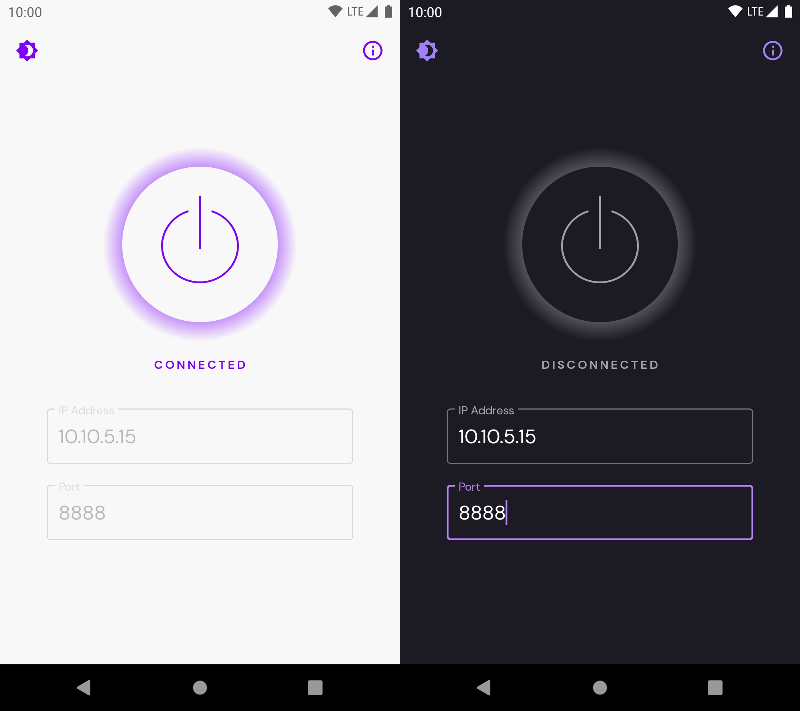

# Proxy Toggle

Small application to help Android and Test Engineers to quickly enable/disable global proxy settings without the faff of going through the annoying Network Settings path.

---


**It's everyone's responsibility to keep this document up to date as part of each release, or if you find something that needs updating.**


## App installation

If you're only interested in using the app, you can grab the [latest release](https://github.com/theappbusiness/android-proxy-toggle/releases/latest), connect your device and execute the installation script from your Terminal:

```bash
./installAndGrantPermission.sh
```
### Android 5.x

Because of old `adb` limitations, if you want to install the app in devices running Android 5.x, you must run two commands separately:

```bash
adb install -t -r proxy-toggle.apk
adb shell pm grant com.kinandcarta.create.proxytoggle android.permission.WRITE_SECURE_SETTINGS
```

## Project setup

No special setup required. Just clone the repository and it should build out of the box.
At the moment of writing this, the project is being created using Android Studio 4.2 Canary 3.

## About the app

### Supported devices

This app supports Android 5.0 and above.

### Architecture

The project has a small `app` module and the different features (manager screen, widget, tile) each have their own module. Things used by several modules are included in `core` module. Finally, there's a `test-utils` module for things shared by many modules' test source-trees.

The app follows MVVM Clean Architecture principles.

### Dependency Injection

We currently use [Hilt](https://developer.android.com/training/dependency-injection/hilt-android) for Dependency Injection.  
Each Activity and Fragment that use DI must be annotated with `@AndroidEntryPoint`.  
Each ViewModel must be injected using `@ViewModelInject` in order to be provided using `by viewModels()`.

### Testing

We use Github Actions to execute all Unit Tests in the project for every PR against the `main` branch.
JaCoCo is setup to run test coverage. We should aim to increase test coverage on each PR.
At the moment of writing this, Hilt and JaCoCo are not totally compatible, so the total coverage shown is not accurate.

### Features

#### Quick proxy setup





Easy setup: just add your desired IP and port, enable the proxy and _voilà!_, all done, your whole device will be proxied.

#### Home Screen Widget


The app features a Home Screen widget that the user can use to quickly toggle the proxy with the last used setup, without having to even open the app.
It will also allow the user to launch the app to configure the proxy settings, if needed.

#### Quick Setting Tile


Similarly to the widget, Android 7.0 and above users will have the option to add a Quick Settings Tile in their Notification Drawer.
This tile will allow the users to toggle the proxy even without having to leave the current application they are using.

## Caveats

### WRITE_SECURE_SETTINGS permission

The app will make use of [Settings.Global](https://developer.android.com/reference/android/provider/Settings.Global). Since this is a system setting, it's normally a read-only setting.
This small inconvenience is bypassed by granting the app `WRITE_SECURE_SETTINGS` special permission.

> Note: this is a protected permission that only System apps should be granted. Be extra careful when you grant this permission for unknown sources apps.

In order to grant this permission once the app is installed, connect the device to your computer and execute the following command on your Terminal:

```bash
adb shell pm grant com.kinandcarta.create.proxytoggle android.permission.WRITE_SECURE_SETTINGS
```

Alternatively, you can grant the permission when installing the app via the command `adb install -g App.apk` or just use the provided `installAndGrantPermission.sh` script.

### Be careful when uninstalling the app

Uninstalling the app with the proxy enabled will permanently leave your device with this setup (as it's a Settings.Global configuration!). 

> You should make sure the proxy is disabled before uninstalling the app!

Since we can't guarantee this is going to happen, we also provide the `uninstallAndCleanUp.sh` script for making sure everything is in a clean state after uninstalling the app.

Alternatively, you could run the following commands on your Terminal to clean up the proxy setting:

```bash
adb shell settings delete global http_proxy
adb shell settings delete global global_http_proxy_host
adb shell settings delete global global_http_proxy_port
```

## License

Proxy Toggle is available under the MIT license. See the [LICENSE](LICENSE.md) file for more info.
